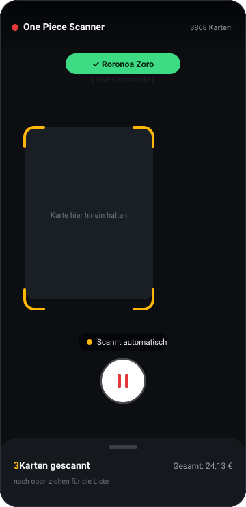
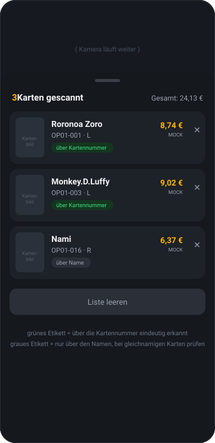

# Anleitung — One Piece Scanner

> **Hinweis zu den Abbildungen:** Die Bilder unten sind **maßstabsgetreue Nachbildungen aus dem
> UI-Code**, keine echten Screenshots. In der Entwicklungsumgebung war kein Android-Gerät und kein
> Emulator verfügbar. Sobald die App auf dem Handy läuft, werden sie durch echte Screenshots ersetzt.

---

## 1. App installieren (Android)

1. Auf dem Handy diesen Link öffnen — das ist der direkte Download:
   **https://github.com/FeyzAras/onepiece-scanner/releases/download/v0.1.0/onepiece-scanner.apk**
   (Übersicht aller Versionen: https://github.com/FeyzAras/onepiece-scanner/releases)
2. Die Datei **`onepiece-scanner.apk`** (76 MB) wird heruntergeladen.
3. Die heruntergeladene Datei öffnen (Benachrichtigung antippen oder in „Downloads").
4. Android fragt: *„Aus dieser Quelle dürfen keine unbekannten Apps installiert werden"* →
   **Einstellungen** antippen → **„Aus dieser Quelle zulassen"** aktivieren → zurück → **Installieren**.
5. Beim ersten Start fragt die App nach der **Kamera-Berechtigung** → **Zulassen**.

> Die App ist mit einem Entwickler-Schlüssel signiert, nicht über den Play Store verteilt. Deshalb
> die Rückfrage von Android — das ist normal bei selbst gebauten Apps.

**Es gibt keine Internetpflicht:** Erkennung und Kartendaten liegen komplett in der App. Internet
wird nur benutzt, um die Kartenbilder in der Liste nachzuladen.

---

## 2. Scannen

So läuft es ab:

1. App öffnen — die Kamera startet und **scannt sofort von allein**. Kein Knopfdruck nötig.
2. Karte so halten, dass sie **im goldenen Rahmen** liegt.
3. Sobald die App die Karte erkennt:
   - kurzes **Vibrieren**
   - grüne Bestätigung oben: **✓ Kartenname**
   - Eintrag wandert unten in die Liste
4. Nächste Karte davor halten. Dieselbe Karte wird innerhalb von 4 Sekunden **nicht doppelt**
   eingetragen — du kannst sie also ruhig im Bild lassen.

**Der runde Knopf unten ist kein Auslöser**, sondern Pause/Weiter. Nützlich, wenn du kurz etwas
anderes machst und nicht willst, dass die App im Hintergrund weiter Karten einsammelt.

### Damit die Erkennung gut funktioniert
- **Licht**: gleichmäßig, nicht direkt von oben — Spiegelungen auf Folienkarten sind der häufigste Grund für Fehlversuche.
- **Abstand**: Karte den Rahmen gut ausfüllen lassen.
- **Ruhig halten**: ca. eine halbe Sekunde, die App wertet mehrmals pro Sekunde aus.
- **Gerade halten**: stark schräge Winkel erschweren das Lesen der Kartennummer.

---

## 3. Die Liste

Die Liste am unteren Rand **nach oben ziehen**, um alle gescannten Karten zu sehen.

| Element | Bedeutung |
| --- | --- |
| **Gesamt** oben rechts | Summe aller Preise in der aktuellen Sitzung |
| 🗂 **Ordner-Zeile** | Gruppiert die Treffer nach Sammelkartenspiel, mit Anzahl und Zwischensumme. Aktuell gibt es nur One Piece — die Struktur ist für weitere Spiele vorbereitet |
| 🟩 **über Kartennummer** | Die App hat die aufgedruckte Nummer (z. B. `OP01-001`) gelesen — **eindeutig**, auch bei mehreren Karten mit demselben Namen |
| ⬜ **über Name** | Nur der Name war lesbar — bei gleichnamigen Karten (z. B. den vielen „Roronoa Zoro"-Versionen) kann die falsche Variante getroffen sein; kurz prüfen |
| **Cardmarket Trend** | Echter Cardmarket-Preis. Steht stattdessen „Durchschnitt" o. Ä., gab es für diese Karte keinen Trendpreis |
| **✕** | Einzelnen Eintrag entfernen |
| **Liste leeren** | Alles entfernen (mit Rückfrage) |

> **Achtung:** Die Liste lebt nur, solange die App offen ist. Beim Schließen ist sie weg —
> dauerhaftes Speichern ist noch nicht eingebaut.

---

## 4. Zu den Preisen

Die Preise sind **echte Cardmarket-Preise** — 3.865 von 3.868 Karten (99,9 %) haben einen.
Angezeigt wird Cardmarkets **Trendpreis**, der Stand steht unter dem Betrag.

Sie stammen aus den Export-Dateien, die Cardmarket seit Juli 2025 selbst täglich veröffentlicht und
ausdrücklich zur Nutzung in eigenen Anwendungen freigibt — kein API-Zugang, kein Scraping.

**Wichtig:** Die Preise sind in der App **fest eingebaut**, nicht live. Sie entsprechen dem Stand,
der beim Bauen der App aktuell war. Für neuere Preise muss eine neue Version gebaut werden —
automatische Aktualisierung ist noch nicht eingebaut.

**Eine bekannte Ungenauigkeit:** Alternative Artworks („Alt Art") bekommen derzeit den Preis der
normalen Version, obwohl sie real meist deutlich teurer sind. Cardmarket führt beide unter demselben
Namen, eine saubere Trennung braucht noch Zusatzarbeit.

---

## 5. Wenn etwas nicht klappt

**Eingebaute Diagnose:** Halte den **Kopfbereich oben** (dort, wo „One Piece Scanner" steht) kurz
gedrückt. Dann erscheint eine Anzeige mit: wie viele Kamerabilder ankommen, wie viele davon
ausgewertet wurden, welches Bildformat die Kamera liefert, welchen Text die Erkennung zuletzt
gelesen hat und ob ein Fehler auftrat. Nochmal lange drücken blendet sie wieder aus.

Das ist der schnellste Weg, ein Problem einzugrenzen — mach davon einen Screenshot, wenn etwas
nicht geht.

| Problem | Was tun |
| --- | --- |
| Kamera bleibt schwarz | Berechtigung prüfen: Einstellungen → Apps → One Piece Scanner → Berechtigungen → Kamera |
| Es wird gar nichts erkannt | Diagnose einblenden (siehe oben). Steht bei „Bilder von der Kamera" eine Zahl, die steigt, kommt das Bild an. Steht bei „Gelesener Text" nichts, liegt es an Licht/Abstand/Drehung — Screenshot schicken |
| Falsche Variante erkannt | Prüfe das Etikett: steht „über Name" dran, war die Kartennummer nicht lesbar. Karte leicht kippen, damit die Nummer unten besser ins Bild kommt |
| Kartenbilder bleiben leer | Internetverbindung — die Bilder werden von der offiziellen Bandai-Seite nachgeladen |
| App ruckelt / Akku heiß | Über den runden Knopf pausieren, wenn du gerade nicht scannst |

---

## 6. Web-Variante

Es gibt dieselbe Funktion zusätzlich als Web-App unter
https://feyzaras.github.io/onepiece-scanner/ (im Browser öffnen, über das Menü
„Zum Startbildschirm hinzufügen" installierbar).

Sie ist bewusst die Zweitlösung: Die Texterkennung im Browser ist deutlich langsamer
(ca. 2–4 Sekunden pro Versuch statt mehrmals pro Sekunde). Nützlich zum schnellen Ausprobieren
auf einem beliebigen Gerät, inklusive iPhone oder Rechner mit Webcam.
